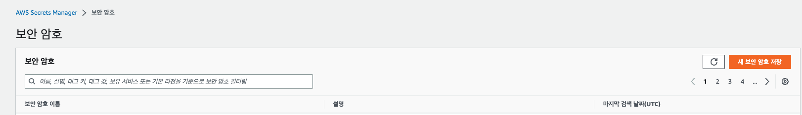
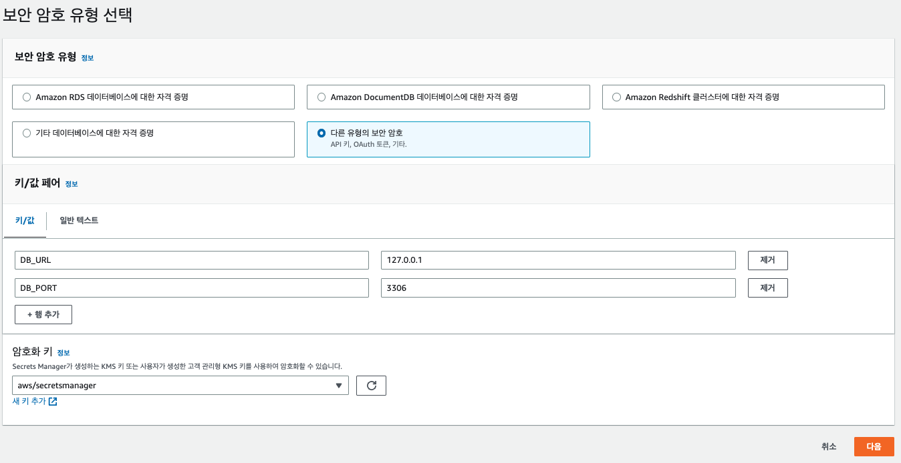
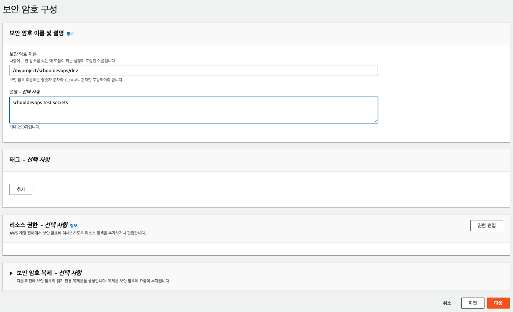
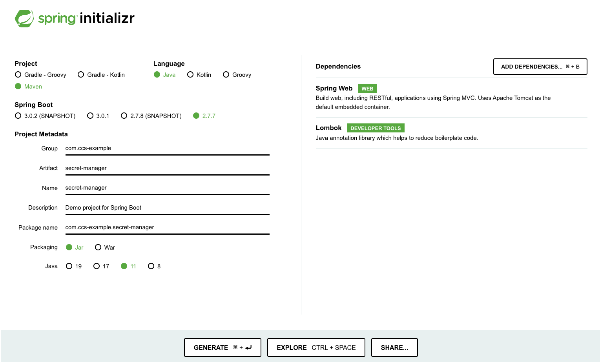

# Spring Cloud 에서 AWS SecretsManager 를 사용한 설정하기

- AWS SecretsManager는 소스 상에 노출된 민감한 정보 (데이터베이스 사용자 이름, 암호, 엔드포인트 및 암호화 키 정보) 등을 저장하는 용도로 제공된 클라우드 리소스이다. 
- 이러한 민감 정보는 소스 상의 설정파일에 노출하면 바로 보안 취약이 발생하며, 한번 소스관리툴에 공개되어 올라가면, 정보를 즉각 변경하지 않으면 치명적인 위협으로 다가올 수 있어 주의가 필요하다.
- 이 SecretsManager 에 저장된 민감 정보들은 다양한 방법으로 어플리케이션에서 사용할 수 있다. 
  - AWS Cli를 이용하여 CI/CD 에서 직접 환경 변수를 교체할 수 있다. 
  - Spring Cloud 에서 제공하는 configuration 서버로 SecretsManager 를 이용할 수 있다. 

- 우리는 여기서 Configuration Server로서 SecretsManager를 사용하는 방법에 대해서 알아볼 것이다. 

## SecretsManager 에 시크릿 생성하기 

- 우선 민감 정보를 SecretsManager 에 저장하기 위해서는 다음과 같은 과정으로 SecretsManager를 생성하자. 

- 다음과 같이 "새 보안 암호 저장" 버튼을 클릭한다. 



- 저장할 민감정보를 아래와 같이 지정한다. (키/값 형식으로 지정한다.)



- 시크릿 이름을 ``/myproject/schooldevops/dev`` 으로 생성한다 



## AWS Credential 저장하기

- AWS Console에서 IAM > 사용자 > 보안자격증명 > 액세스 키 만들기 버튼을 통해서 credential 을 생성한다. 

```shell

$ aws configure 

AWS Access Key ID [****************TVYO]: 
AWS Secret Access Key [****************/MX0]: 
Default region name [ap-northeast-2]: 
Default output format [json]: 

```

- credential 을 정상으로 지정했다면, 이제 어플리케이션에서 AWS에 직접 접근할 수 있게 된다. 
- 참고로 해당 사용자에 대해서 SecretsManager 에 대한 권한을 "SecretsManagerReadWrite" 권한이 부여되어 있어야한다.
- 다양한 접근 권한에 대해서는 AWS Credential 이외에도 AssumeRole, 특정 EC2 인스턴스에 정책 부여를 통해서 SecretsManager에 접근을 할 수 있으니 AWS 메뉴얼을 참조하자. 


## SpringBoot 프로젝트 생성하기 with Spring Cloud



- 위와 같이 start.spring.io 에 접속하여 새로운 프로젝트를 생성한다.
- 생성된 이후 꼭 spring boot와 spring cloud의 버젼을 매핑해야한다. (주의)

### Spring Cloud 와 Spring Boot 호환버젼 체크하기

from: https://spring.io/projects/spring-cloud

- Compatibility Matrix

|Spring Cloud|	Spring Boot|
|---|---|
|2021.0.3+ aka Jubilee|	2.6.x, 2.7.x|
|2021.0.x aka Jubilee|	2.6.x|
|2020.0.3+ aka Ilford|	2.4.x, 2.5.x|
|2020.0.x aka Ilford|	2.4.x|

- ⚠ Below Spring Cloud versions have all reached end of life status and are no longer supported.

|Spring Cloud|	Spring Boot|
|---|---|
|Hoxton.SR5+|	2.2.x, 2.3.x|
|Hoxton|	2.2.x|
|Greenwich|	2.1.x|
|Finchley|	2.0.x|
|Edgware|	1.5.x|
|Dalston|	1.5.x|
|Camden.SR5+|	1.4.x, 1.5.x|
|Camden|	1.4.x|
|Brixton|	1.3.x, 1.4.x|
|Angel|	1.2.x|

- 위와 같이 호환성을 우선 체크하고 나서 스프링부트 작업을 수행해야한다. 
- 버젼이 맞지 않으면 어플리케이션이 정상동작 하지 않는다. 

### 의존성 파일 추가하기 

- 우리가 사용할 버젼은 다음과 같다. 
  - Spring Boot: 2.5.6
  - Spring Cloud: 3.0.3

- pom.xml 파일에 다음과 같이 추가하자. 
  
```xml

		<dependency>
			<groupId>org.springframework.cloud</groupId>
			<artifactId>spring-cloud-starter-bootstrap</artifactId>
			<version>3.0.3</version>
		</dependency>
		<dependency>
			<groupId>org.springframework.cloud</groupId>
			<artifactId>spring-cloud-starter-aws-secrets-manager-config</artifactId>
			<version>2.2.6.RELEASE</version>
		</dependency>
```

### 시크릿 매니저 설정 추가하기 

- 시크릿 매니저 설정을 위해서 다음 내용을 bootstrap.yaml 파일에 추가하자. 

```yaml
aws:
  secretsmanager:
    name: schooldevops/dev
    prefix: /myproject

cloud:
  aws:
    region:
      static: ap-northeast-2
```

- 우리는 사전에 secretsManqger 이름을 /myproject/schooldevops/dev 로 작성했다. 
- prefix: 시크릿 매니저에서 생성한 prefix 이름이다. 반드시 /를 추가해 주는 것을 확인하자. 지정하지 않는다면 /sectets 가 기본값이다.  
- name: name은 첫번째 delimeter 이후의 이름을 작성해준다. 

- cloud 의 region 을 ap-northeast-2 로 서울 리젼으로 설정했다. 시크릿을 생성한 리젼을 작성해 주는 것을 잊지 말자. 

### Test를 위한 Controller 작성하기. 

- TestController.java 파일을 생성하고 다음과 같이 코드를 작성하자. 

```java
package com.ccsexample.secretmanager;

import org.springframework.beans.factory.annotation.Value;
import org.springframework.web.bind.annotation.GetMapping;
import org.springframework.web.bind.annotation.RestController;

@RestController
public class TestController {
    
    @Value("${DB_URL}")
    String dbpassword;

    @Value("${DB_PORT}")
    String dbusername;

    @GetMapping("/test")
    public String getValue() {
        return dbpassword + ":" + dbusername;
    }
}


```

- 위 코드에서 핵심 사항은 ``@Value(${SecretsManager에 지정한 키값})`` 이다.
- 이렇게 되면 인스턴스가 기동될때 AWS SecretsManager로 부터 해당 시크릿을 검색하고 키에 해당하는 값을 변수에 할당하게 된다. 

### 테스트하기 

- 서버가 기동되고 이후에 다음과 같이 커맨드를 실행하면 우리가 원하는 값을 확인할 수 있다. 

```shell
$ curl localhost:8080/test

127.0.0.1:3306
```